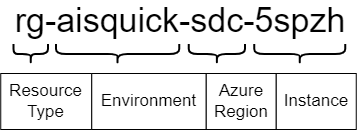

# Naming Convention for Azure Developer CLI (azd) templates

[naming-conventions.bicep](./naming-conventions.bicep) is a Bicep file that defines a set of user-defined functions to implement a naming convention for Azure resources. 
The naming convention is a variation on the naming convention of the Azure Cloud Adoption Framework (CAF), as described on [Azure Resource Naming Best Practices](https://learn.microsoft.com/en-us/azure/cloud-adoption-framework/ready/azure-best-practices/resource-naming). 
The workload and environment are combined into a single identifier to better support the `azd` workflow. See the following image:



This naming convention is implemented using a variation of the Bicep user-defined functions, as described in the blog post [Apply Azure naming convention using Bicep functions](https://ronaldbosma.github.io/blog/2024/06/05/apply-azure-naming-convention-using-bicep-functions/).

## Usage

The following example shows how to create the name of a resource group:

```bicep
import { getResourceName, getInstanceId } from './naming-conventions.bicep'

var environmentName = 'myenv'
var location = 'norwayeast'
var instance = ''

var instanceId = getInstanceId(environmentName, location, instance)
var resourceGroupName = getResourceName('resourceGroup', environmentName, location, instanceId)
```

The `getInstanceId` function will return the `instance` value if provided, else it will generate a 5-character string based on the subscription id, environment name and location.

The result will look like this: `rg-aisquick-sdc-5spzh`

## Tests

The [tests](./tests) folder contains a set of tests that validate the naming convention. The tests are implemented using the Bicep Test Framework.

To execute the tests, navigate to the tests folder and execute the following command:

```
bicep test .\naming-conventions.tests.bicep
```